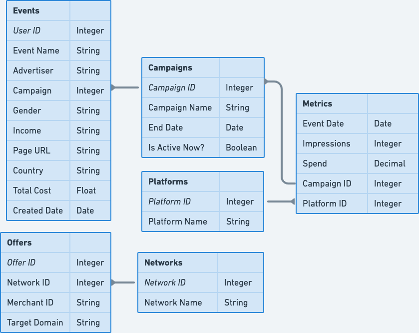

# Solution Brief

This reference solution is an accelerator for the adtech industry. It provides table structures, common queries, Looker dashboards, and benchmarks to help you get started with SingleStore DB.

This solution provides the following suggested tables:

* Campaigns: ads that are running on a traffic platform
* Events: activities that happen for a given campaign such as an impression or conversion
* Commissions: payment from merchants
* Affiliate Networks: provide offers and report commissions
* Offers: items available from merchants
* Traffic Platforms: companies that serve ads to users

## System Requirements

The examples that follow have been tested on a SingleStore DB `S0` cluster with 2 vCPUs, 16 GB RAM, and 256 GB of disk.

Your SingleStore DB cluster must be able to read from an Amazon S3 bucket.

## Creating Tables and Loading Sample Data

To create the tables and load data into them, run the following script by pasting the contents into the SQL Editor section of SingleStore Studio and clicking the "Run" button:

https://github.com/memsql/reference_solutions/blob/master/adtech/setup.sql

Each table has a corresponding pipeline that loads from a compressed tab-separated file. Each file is available in a `small`, `medium`, and `large` variants. For example, the default is to load `events-large.tsv.gz`, but you could also chooe from `events-small.tsv.gz` or `events-medium.tsv.gz`.

## Benchmarks

To validate the performance of this reference solution on your SingleStore DB cluster, see [benchmarks/README.md](benchmarks/README.md).

## Looker Dashboards

After following the instructions in [looker/README.md](looker/README.md), you will have access to the following dashboards:

* Ad Events: information about events such as clicks, impressions, and downstream conversions by country, top 5 advertisers, and income.
* Advertisers: advertiser activity by country, gender, click through rate, and total impressions.
* Campaign Performance Lookup: clicks and click through rate, total impressions, and total cost per campaign.
